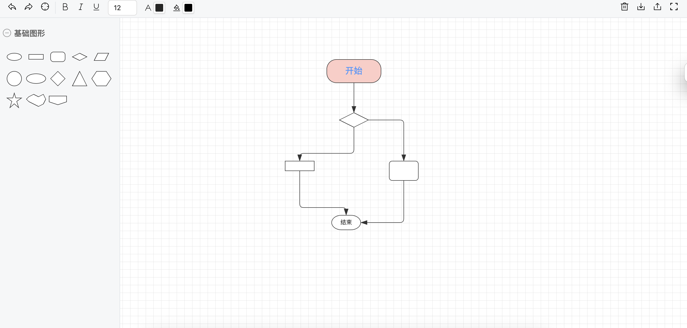
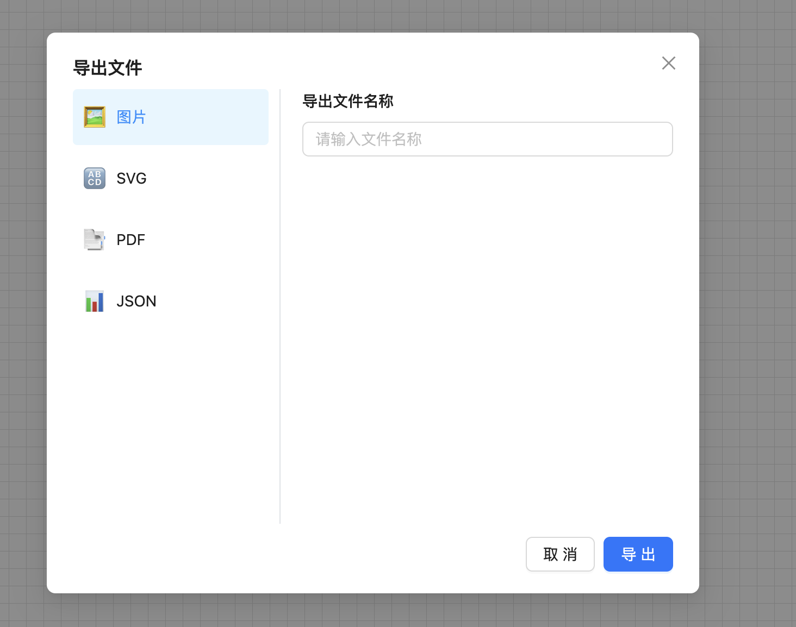
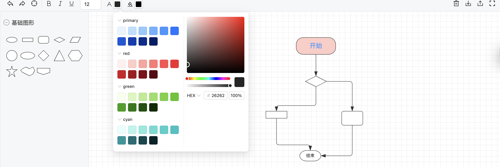
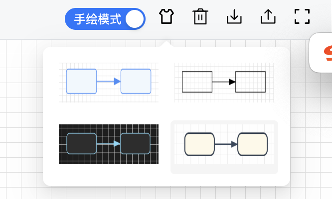
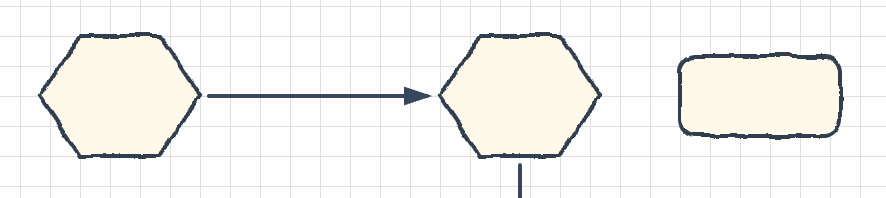

# du-editor
## 基于X6的流程图编辑器
- 纯前端零后端，数据不出本地，安全无忧  
- 专为图编辑学习者打造，源码级参考范例  
- 节点类型一应俱全，拖即用，创意不设限  
- 一键导出 PNG、SVG、PDF、JSON，分享与存档都方便  
- 一键换肤，内置多款主题，明暗随心  
- Web、Windows、macOS 全平台覆盖，随时随地作图  
- 支持 JSON 导入导出，版本管理与协作更轻松
- 完全免费的手绘模式

## feature:
- ✅ 小地图
- ✅ 字体颜色、大小、 背景色. 
- ✅ 导出
- ✅ 导入
- [ing]更多的基本图形
- ✅ 导出配置支持：图片大小、背景颜色、padding
- [ing]集成Electron做成一个桌面端应用
- [ing]支持从模版创建
- ✅ 支持层级
- ✅ 支持节点右键菜单、删除、组合、层级、等等
- [ing]支持插入图片
- [ing]支持富文本
- ✅ 支持调整边的样式、颜色
- [ing]支持调整文本布局
- [ing]支持泳道节点
- [ing]支持思维导图
- [ing]支持边任意创建，创建直线
- [ing]支持创建备注
- [ing]支持从节点的任意位置创建边
- [ing]支持格式刷
- [ing]支持导出PDF
- [ing]支持创建文件夹
- [ing]支持多语言
- ✅ 支持主题切换
- ✅ 支持画布风格、手绘风格等等
- ..........

## demo

## 贡献
热烈欢迎提交PR，点个star再走嘛